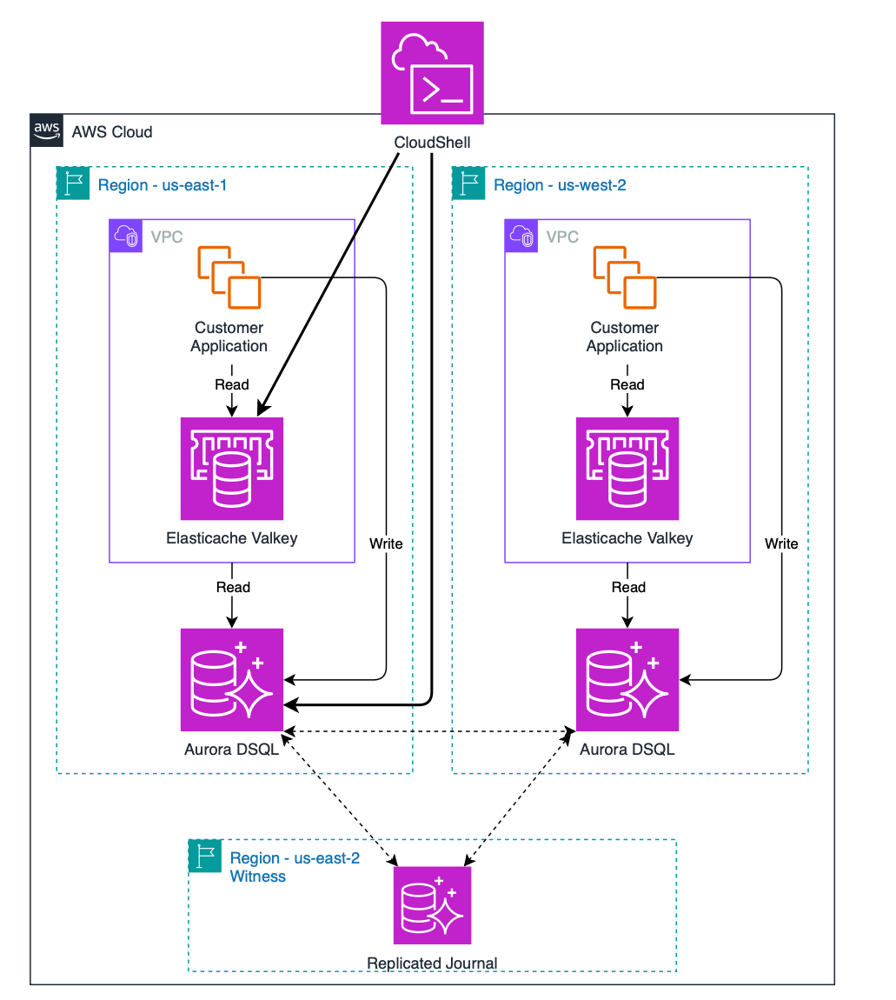
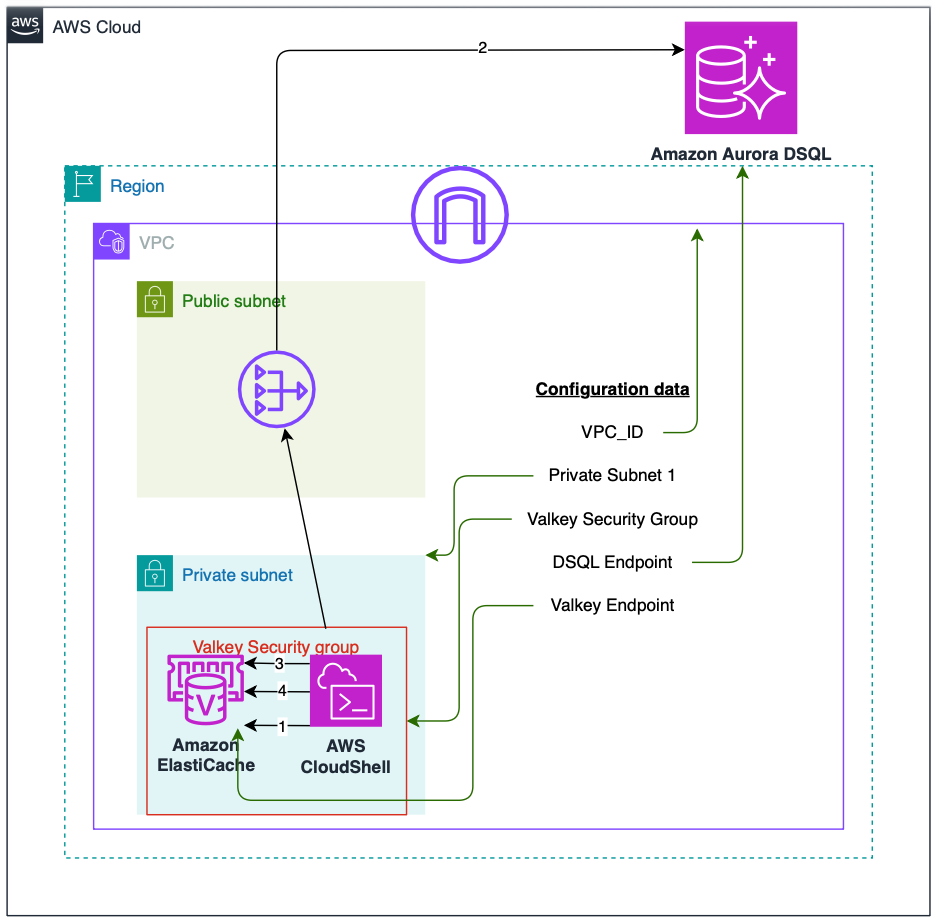

# Amazon Aurora DSQL + Amazon ElastiCache Performance Demo

This demo showcases the performance benefits of using Amazon ElastiCache (Valkey) as a caching layer in front of Amazon Aurora DSQL (PostgreSQL-compatible distributed database).

## Architecture

- **Amazon Aurora DSQL**: PostgreSQL-compatible distributed SQL database
- **Amazon ElastiCache (Valkey)**: Valkey-compatible in-memory cache with TLS
- **Environment**: AWS CloudShell within VPC for secure connectivity

### Architecture Diagram

<div align="center">
  
</div>

## Prerequisites

Before running this demo, you'll need:

- **AWS Region**: Any region that supports Amazon Aurora DSQL and Amazon ElastiCache (e.g., us-east-1, us-west-2)
- **VPC Setup**: A VPC with appropriate security groups for Amazon Aurora DSQL and Amazon ElastiCache connectivity
- **Amazon Aurora DSQL Cluster**: A running DSQL cluster endpoint (format: `cluster-id.dsql.region.on.aws`)
- **Amazon ElastiCache (Valkey)**: A Valkey serverless cache (format: `cache-name.serverless.region.cache.amazonaws.com`)
- **AWS CloudShell**: Running within the VPC for secure connectivity

<div align="center">
  
</div>

The best option is to use the provided CloudFormation template to deploy a Multi-region architecture for Amazon Aurora DSQL and Amazon ElastiCache (Valkey). 

Refer to [CloudFormation/README](cloudformation/README.md) for instructions on how to deploy the solution.

## CloudShell VPC Setup

After deploying the CloudFormation stack, you need to create a CloudShell VPC environment to access your resources securely.

### Step 1: Get VPC Configuration from CloudFormation

Retrieve the VPC, subnet, and security group information from your CloudFormation stack:

```bash
# Get VPC ID
VPC_ID=$(aws cloudformation describe-stacks --stack-name dsql-multi-region --region us-east-1 --query 'Stacks[0].Outputs[?OutputKey==`VPCId`].OutputValue' --output text)

# Get Private Subnet ID
SUBNET_ID=$(aws cloudformation describe-stacks --stack-name dsql-multi-region --region us-east-1 --query 'Stacks[0].Outputs[?OutputKey==`PrivateSubnet1Id`].OutputValue' --output text)

# Get Valkey Security Group ID
SG_ID=$(aws cloudformation describe-stacks --stack-name dsql-multi-region --region us-east-1 --query 'Stacks[0].Outputs[?OutputKey==`ValkeySecurityGroupId`].OutputValue' --output text)

echo "VPC ID: $VPC_ID"
echo "Subnet ID: $SUBNET_ID"
echo "Security Group ID: $SG_ID"
```

### Step 2: Create CloudShell VPC Environment

Follow the AWS documentation to create a CloudShell VPC environment: [Creating a CloudShell VPC Environment](https://docs.aws.amazon.com/cloudshell/latest/userguide/creating-vpc-environment.html)

**Steps:**
1. On the CloudShell console page, choose the **+** icon and then choose **Create VPC environment**
2. Enter a name for your VPC environment (e.g., `dsql-demo-vpc`)
3. From the **Virtual private cloud (VPC)** dropdown, choose the VPC ID from Step 1
4. From the **Subnet** dropdown, choose the Private Subnet ID from Step 1
5. From the **Security group** dropdown, choose the Valkey Security Group ID from Step 1
6. Choose **Create** to create your VPC environment
7. Wait for the VPC environment to be ready (this may take a few minutes)
8. Once ready, switch to the new VPC environment from the CloudShell dropdown

### Step 3: Get Service Endpoints and Clone Repository

Once your CloudShell VPC environment is running, set up the environment variables and clone this repository:

```bash
# Set environment variables from CloudFormation outputs
export AWS_REGION="us-east-1" && \
export DSQL_ENDPOINT=$(aws cloudformation describe-stacks --stack-name dsql-multi-region --region us-east-1 --query 'Stacks[0].Outputs[?OutputKey==`DSQLClusterEndpoint`].OutputValue' --output text) && \
export VALKEY_ENDPOINT=$(aws cloudformation describe-stacks --stack-name dsql-multi-region --region us-east-1 --query 'Stacks[0].Outputs[?OutputKey==`ValkeyEndpoint`].OutputValue' --output text) && \
echo "Environment Variables Set:" && \
echo "AWS_REGION: $AWS_REGION" && \
echo "DSQL_ENDPOINT: $DSQL_ENDPOINT" && \
echo "VALKEY_ENDPOINT: $VALKEY_ENDPOINT"

# Clone the repository
git clone https://github.com/aws-samples/sample-boost-query-performance-for-amazon-aurora-dsql-with-amazon-elasticache.git
cd sample-boost-query-performance-for-amazon-aurora-dsql-with-amazon-elasticache
```

**Note:** If you deployed to a different region (e.g., `us-west-2`), replace `us-east-1` with your region in the commands above.

You're now ready to run the Quick Start demo!

## Quick Start


### Option 1: Automated Demo (Recommended)
```bash
./quick_start.sh
```
**What happens:**
1. **Interactive Setup**: You'll be prompted once for your AWS configuration:
   - AWS Region (e.g., us-east-1)
   - Amazon Aurora DSQL cluster endpoint 
   - Amazon ElastiCache (Valkey) endpoint
2. **Automated Demo**: Complete performance demonstration runs automatically
3. **Persistent Config**: Settings are saved as environment variables for subsequent runs

### Option 2: Manual Steps
```bash
# 1. Set environment variables (one-time setup)
export AWS_REGION="your-region"
export DSQL_ENDPOINT="your-dsql-endpoint"
export VALKEY_ENDPOINT="your-valkey-endpoint"

# 2. Setup database
python3 setup_database.py

# 3. Run performance test (cache miss)
python3 cloudshell_dsql_elasticache.py

# 4. Run again immediately (cache hit)
python3 cloudshell_dsql_elasticache.py
```

### Option 3: Command Line Arguments
```bash
# Direct execution with arguments (legacy support)
python3 cloudshell_dsql_elasticache.py your-dsql-endpoint your-valkey-endpoint
python3 cloudshell_dsql_elasticache.py your-region your-dsql-endpoint your-valkey-endpoint
```

## Expected Performance Results

### Amazon Aurora DSQL Performance Pattern (Observed)
- **Initial query**: 200-250ms during compute scaling
- **Subsequent queries**: 8-10ms with scaled compute resources
- **With connection pooling**: Reduced connection overhead for iterations 2-10
- **Performance variability**: 25x difference between cold and warm states

### Amazon ElastiCache Consistency (Observed)
- **Cache retrieval**: 1.3ms consistent performance
- **Performance predictability**: Eliminates both scaling delays and query execution time
- **User experience**: Predictable response times regardless of Amazon Aurora DSQL state

### Connection Pooling Benefits
- **Connection reuse**: Eliminates connection establishment overhead (typically 50-100ms)
- **Resource efficiency**: Maintains pool of 5-30 connections for immediate use
- **Token management**: Automatic Amazon Aurora DSQL authentication token refresh
- **Concurrent support**: Better handling of multiple simultaneous queries

## Files

- **`cloudshell_dsql_elasticache.py`** - Main performance test script
- **`setup_database.py`** - Database schema creation and test data
- **`setup_cloudshell.sh`** - Environment setup (optional)
- **`quick_start.sh`** - Complete automated demo

## Configuration

Environment variables (optional):
```bash
export DSQL_ENDPOINT="your-dsql-endpoint"
export VALKEY_ENDPOINT="your-valkey-endpoint"
export VALKEY_TTL="30"  # Cache TTL in seconds (default: 30 seconds)
export QUERY="select * from users1"  # Custom query to test

# Connection Pool Settings
export DSQL_POOL_MIN="5"   # Minimum connections (default: 5)
export DSQL_POOL_MAX="30"  # Maximum connections (default: 30)
export DSQL_POOL_TIMEOUT="30"  # Connection timeout in seconds
```

## Requirements

- AWS CloudShell environment within the VPC
- IAM permissions for Amazon Aurora DSQL and Amazon ElastiCache
- Python packages: `valkey`, `psycopg2-binary`, `boto3` (auto-installed)

## Authentication

- **Amazon Aurora DSQL**: Uses IAM authentication tokens (no hardcoded credentials)
- **Amazon ElastiCache**: TLS connection with VPC security groups

## Demo Flow

1. **Cache Miss**: Query Amazon Aurora DSQL directly → Measure timing → Store in cache
2. **Cache Hit**: Retrieve from Amazon ElastiCache → Compare performance
3. **Results**: Display speedup metrics and percentage improvement

## What the Quick Start Does

The quick start script will execute the following:

1. **Interactive Setup**: Prompts for AWS configuration (region, Amazon Aurora DSQL endpoint, Amazon ElastiCache Valkey endpoint)
2. **Set Environment Variables**: Configures AWS_REGION, DSQL_ENDPOINT, VALKEY_ENDPOINT
3. **Install Python Dependencies**: Installs redis, psycopg2-binary, boto3
4. **Create Database Schema**: Sets up users and orders tables with optimized OLTP structure
5. **Load Test Data**: Creates 500 users and 2,500 orders (5 orders per user average, 2-3 minute setup)
6. **Initialize Connection Pool**: Creates Amazon Aurora DSQL connection pool (min=5, max=30 connections)
7. **First Performance Test (Amazon Aurora DSQL Cold Start)**:
   - **Iteration 1**: Cache miss → Amazon Aurora DSQL query (~200-300ms compute initialization) → Cache hydration
   - **Iterations 2-10**: Cache hits → Amazon ElastiCache retrieval (~2ms) using pooled connections
8. **Second Performance Test (Amazon Aurora DSQL Warm)**:
   - **Iteration 1**: Cache miss → Amazon Aurora DSQL query (~8-15ms scaled compute) → Cache hydration  
   - **Iterations 2-10**: Cache hits → Amazon ElastiCache retrieval (~2ms) using pooled connections
9. **Third Performance Test (Connection Pool Optimized)**:
   - **Iteration 1**: Cache miss → Amazon Aurora DSQL query (~5-10ms optimized connections) → Cache hydration
   - **Iterations 2-10**: Cache hits → Amazon ElastiCache retrieval (~2ms) using pooled connections
10. **Comprehensive Analysis**: Shows three-way performance comparison:
   - **Amazon Aurora DSQL Cold**: 200-300ms (compute scaling variability)
   - **Amazon Aurora DSQL Warm**: 8-15ms (consistent scaled performance)
   - **Amazon Aurora DSQL Optimized**: 5-10ms (connection pool benefits)
   - **Cache**: ~2ms (predictable performance regardless of Amazon Aurora DSQL state)

The demo demonstrates how Amazon ElastiCache eliminates Amazon Aurora DSQL compute variability while connection pooling progressively optimizes resource usage. Users get consistent ~2ms response times whether Amazon Aurora DSQL is experiencing cold starts, running with scaled compute, or fully optimized with connection pooling.

## Verification & Troubleshooting

### Check Amazon ElastiCache (Valkey) Cache Entries

To inspect what's stored in the Amazon ElastiCache (Valkey) cache:

```bash
# Connect to Valkey using TLS
valkey-cli -h YOUR_VALKEY_ENDPOINT -p 6379 --tls

# Check if your query is cached
EXISTS "select * from users1"
# Returns: 1 if key exists, 0 if not

# Get a specific cached query result
GET "select * from users1"
# Shows the JSON data: {"result":"...", "dsql_time_seconds":0.082}

# Check TTL (time-to-live) for a key  
TTL "select * from users1"
# Shows remaining seconds, or -1 if no expiry, -2 if key doesn't exist

# List all keys using SCAN (production-safe)
SCAN 0
# Returns cursor and keys. Use cursor in next SCAN if needed

# Search for keys matching a pattern
SCAN 0 MATCH "*users*" COUNT 100

# Alternative: KEYS command (use only in development)
KEYS "*"
# Note: KEYS command may block server and is not recommended for production

# Get cache info and stats
INFO memory
INFO stats
```

### Drop Database for Fresh Demo

To reset the demo and start from scratch:

```bash
# Connect to Amazon Aurora DSQL using psql
psql -h YOUR_DSQL_ENDPOINT -U admin -d postgres --set=sslmode=require

# Drop the users table
DROP TABLE IF EXISTS users1;

# Verify table is gone
\dt

# Exit psql
\q
```

Or use the Python cleanup script:

```python
#!/usr/bin/env python3
import subprocess
import psycopg2

# Generate auth token
result = subprocess.run([
    'aws', 'dsql', 'generate-db-connect-admin-auth-token',
    '--hostname', 'YOUR_DSQL_ENDPOINT',
    '--expires-in', '3600'
], capture_output=True, text=True, check=True)
token = result.stdout.strip()

# Connect and drop table
conn = psycopg2.connect(
    host='YOUR_DSQL_ENDPOINT',
    user='admin',
    dbname='postgres',
    password=token,
    sslmode='require'
)
conn.set_session(autocommit=True)
cur = conn.cursor()
cur.execute('DROP TABLE IF EXISTS users1;')
print("[OK] Database reset - users1 table dropped")
conn.close()
```

### Clear Cache Manually

To clear the Amazon ElastiCache for a fresh performance comparison:

```bash
# Connect to Valkey
valkey-cli -h YOUR_VALKEY_ENDPOINT -p 6379 --tls

# Delete specific query cache
DEL "select * from users1"

# Or flush all cache data (use with caution)
FLUSHDB

# Verify cache is empty
SCAN 0
```

### Common Troubleshooting

1. **Connection Issues**:
   ```bash
   # Test Amazon Aurora DSQL connectivity
   aws dsql generate-db-connect-admin-auth-token --hostname YOUR_DSQL_ENDPOINT
   
   # Test Amazon ElastiCache connectivity
   valkey-cli -h YOUR_VALKEY_ENDPOINT -p 6379 --tls ping
   ```

2. **Permission Issues**:
   ```bash
   # Check IAM permissions
   aws sts get-caller-identity
   aws iam list-attached-user-policies --user-name $(aws sts get-caller-identity --query 'Arn' --output text | cut -d'/' -f2)
   ```

3. **VPC/Security Group Issues**:
   ```bash
   # Check VPC and security groups
   aws ec2 describe-vpcs --vpc-ids YOUR_VPC_ID
   aws ec2 describe-security-groups --group-ids YOUR_SECURITY_GROUP_ID
   ```

4. **Reset Everything**:
   ```bash
   # Complete reset script
   ./setup_database.py  # Recreates fresh data
   valkey-cli -h YOUR_VALKEY_ENDPOINT -p 6379 --tls FLUSHDB  # Clears cache
   ```
